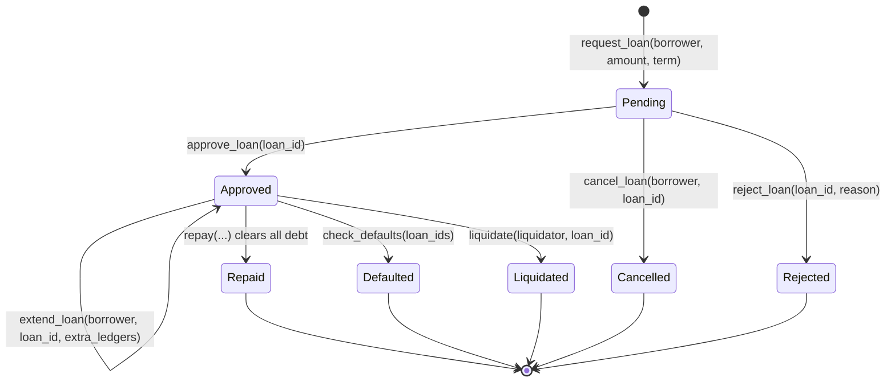

# Soroban Contract State Machine

This page explains how a Remitlend loan moves through the `loan_manager` contract, how the Remittance NFT is used as collateral metadata, and how liquidity flows through the lending pool.

## Contracts involved

- `contracts/loan_manager`: owns the loan state machine and emits loan lifecycle events.
- `contracts/remittance_nft`: stores borrower score data and the seized-collateral flag.
- `contracts/lending_pool`: holds lender liquidity and is the source/destination of loan principal and repayments.

## Loan states

The `LoanStatus` enum currently defines these states:

- `Pending`
- `Approved`
- `Repaid`
- `Defaulted`
- `Liquidated`
- `Cancelled`
- `Rejected`

The contributor-facing lifecycle is mainly:

`Pending → Approved → Repaid / Defaulted / Liquidated / Cancelled`

`Rejected` also exists in the contract and is used when an admin denies a pending request.

## State transition diagram

## Per-state details

### Pending

Created by `request_loan(borrower, amount, term)`.

Checks performed:

- borrower auth required
- loan manager, NFT contract, and lending pool must not be paused
- `amount > 0`
- `amount <= MaxLoanAmount`
- `term > 0`
- borrower score from `remittance_nft.get_score()` must be at least `MinScore`
- borrower must not already be marked seized via `remittance_nft.is_seized()`
- borrower must be below `MaxLoansPerBorrower`

Effects:

- increments `LoanCounter`
- stores a new `Loan` with `status = Pending`
- increments borrower loan count immediately, so pending loans count against the cap
- appends the loan id to the borrower loan list

Events emitted:

- `LoanRequested`
- short-topic event `LoanReq`

Who can trigger it:

- the borrower only

### Approved

Entered by `approve_loan(loan_id)`.

Checks performed:

- admin auth required
- contract stack must not be paused
- loan must exist
- loan must currently be `Pending`
- pool must have enough available liquidity

Effects:

- sets `status = Approved`
- sets `due_date`
- initializes interest and late-fee accounting ledgers
- increases tracked total outstanding principal
- transfers principal from the lending pool to the borrower

Events emitted:

- `LoanApproved`
- `LoanApprv` (`loan_approved_by_admin` helper)

Who can trigger it:

- admin only

### Approved, while being repaid

`repay(borrower, loan_id, amount)` does not always change the state immediately.
A partial repayment keeps the loan in `Approved`.

Effects during repayment can include:

- applying accrued interest and late fees first
- reducing outstanding principal
- transferring tokens from borrower back to lending pool
- updating borrower score through the NFT contract
- emitting `LateFeeCharged` when a late fee is applied
- emitting `LoanRepaid` for repayments

Who can trigger it:

- the borrower only

### Repaid

Reached from `Approved` when `repay(...)` clears the full debt.

Effects:

- sets `status = Repaid`
- decreases tracked total outstanding principal
- decrements borrower loan count
- returns collateral bookkeeping to the borrower path

Events emitted:

- `LoanRepaid`
- `CollateralReturned`
- short-topic collateral release event `ColRel`

Who can trigger it:

- the borrower, via full repayment

### Defaulted

Reached from `Approved` by `check_defaults(loan_ids)`.

Checks performed:

- admin auth required
- loan must still be `Approved`
- current ledger must be past `due_date + DefaultWindowLedgers`

Effects:

- sets `status = Defaulted`
- decreases tracked total outstanding principal
- decrements borrower loan count
- seizes collateral internally
- calls NFT methods to penalize the borrower and record the default

Events emitted:

- `LoanDefaulted`
- NFT-side `Seized` event if collateral was not already marked seized

Who can trigger it:

- admin only, by running the default sweep

### Liquidated

Reached from `Approved` by `liquidate(liquidator, loan_id)`.

This is the under-collateralized or post-failure exit path where collateral is consumed to cover debt.

Effects:

- sets `status = Liquidated`
- repays debt using collateral accounting
- decreases tracked total outstanding principal
- decrements borrower loan count
- emits collateral and liquidation accounting events

Events emitted:

- `CollateralLiquidated`
- `LoanLiquidated`

Who can trigger it:

- an authorized liquidator path, depending on contract checks in `liquidate`

### Cancelled

Reached from `Pending` by `cancel_loan(borrower, loan_id)`.

Checks performed:

- borrower auth required
- loan must still be cancellable in its pending stage

Effects:

- sets `status = Cancelled`
- decrements borrower loan count
- returns any tracked collateral if present

Events emitted:

- `LoanCancelled`
- `CollateralReturned` when collateral existed

Who can trigger it:

- the borrower only

### Rejected

Reached from `Pending` by `reject_loan(loan_id, reason)`.

Effects:

- sets `status = Rejected`
- decrements borrower loan count
- returns any tracked collateral if present

Events emitted:

- `LoanRejected`
- `CollateralReturned` when collateral existed

Who can trigger it:

- admin only

## Transition summary table

| From | To | Function | Caller | Main events |
| --- | --- | --- | --- | --- |
| none | Pending | `request_loan` | borrower | `LoanRequested`, `LoanReq` |
| Pending | Approved | `approve_loan` | admin | `LoanApproved`, `LoanApprv` |
| Pending | Cancelled | `cancel_loan` | borrower | `LoanCancelled`, optional `CollateralReturned` |
| Pending | Rejected | `reject_loan` | admin | `LoanRejected`, optional `CollateralReturned` |
| Approved | Approved | `repay` (partial) | borrower | `LoanRepaid`, optional `LateFeeCharged` |
| Approved | Repaid | `repay` (full) | borrower | `LoanRepaid`, `CollateralReturned`, `ColRel` |
| Approved | Defaulted | `check_defaults` | admin | `LoanDefaulted` |
| Approved | Liquidated | `liquidate` | liquidation path | `CollateralLiquidated`, `LoanLiquidated` |
| Approved | Approved | `extend_loan` | borrower | `LoanExtended` |

## NFT lock and unlock lifecycle

The current NFT contract does **not** implement a literal `lock()` / `unlock()` API.
Instead, loan risk is represented through score data and a seized-collateral flag.

What actually happens:

1. A borrower requests a loan using an existing Remittance NFT score.
2. Approval does **not** call an explicit NFT lock function.
3. If a loan defaults, `loan_manager` calls NFT-side default handling:
   - `decrease_score(...)`
   - `record_default(...)`
   - internally, the NFT contract marks collateral as seized if needed
4. The NFT contract exposes `is_seized(user)` so future loan requests can be blocked.
5. Full repayment does not call an explicit NFT unlock function because there is no separate lock record to clear.

Important nuance:

- `seize_collateral` blocks **new credit activity**.
- It does **not** block repayment of an already-approved loan.

So the contributor mental model should be:

- **approval uses score eligibility**, not a hard NFT lock
- **default/liquidation uses seizure state**, not a hard NFT unlock flow on repayment

## Pool fund allocation and return flow

### Allocation on approval

When `approve_loan` succeeds:

1. loan manager reads the pool balance with `lending_pool.pool_balance(token)`
2. loan manager subtracts already-tracked outstanding principal to compute available liquidity
3. if liquidity is sufficient, the loan is marked `Approved`
4. total outstanding principal is increased
5. tokens are transferred from the lending pool contract to the borrower

### Return flow on repayment

When `repay` is called:

1. borrower transfers tokens back toward the lending pool
2. repayment is applied across fees, interest, and principal
3. when principal is reduced, tracked outstanding exposure falls
4. once the debt is fully cleared, the loan reaches `Repaid`

### Return flow on default or liquidation

- `check_defaults` marks the loan `Defaulted` and removes the principal from tracked outstanding exposure
- `liquidate` settles the position through collateral and also removes the principal from tracked outstanding exposure

### Why the pool tracks both balance and outstanding

The lending pool token balance alone is not enough to determine lendable cash, because some funds may already be committed to active loans.
The loan manager therefore also tracks `TotalOutstanding(token)` and uses:

`available_liquidity = pool_balance - total_outstanding`

That prevents the admin from over-approving loans when the raw pool balance would otherwise look large enough.

## Practical contributor notes

- `request_loan` counts against borrower limits immediately, even before approval.
- `approve_loan` overwrites the term with the contract default term currently read by `read_default_term()`.
- `Rejected` is a real on-chain state even though the original issue summary focuses on the main six states.
- `extend_loan` is a same-state transition on `Approved`, not a separate terminal state.
- The NFT collateral story is seizure-based today, not a strict lock/unlock primitive.
