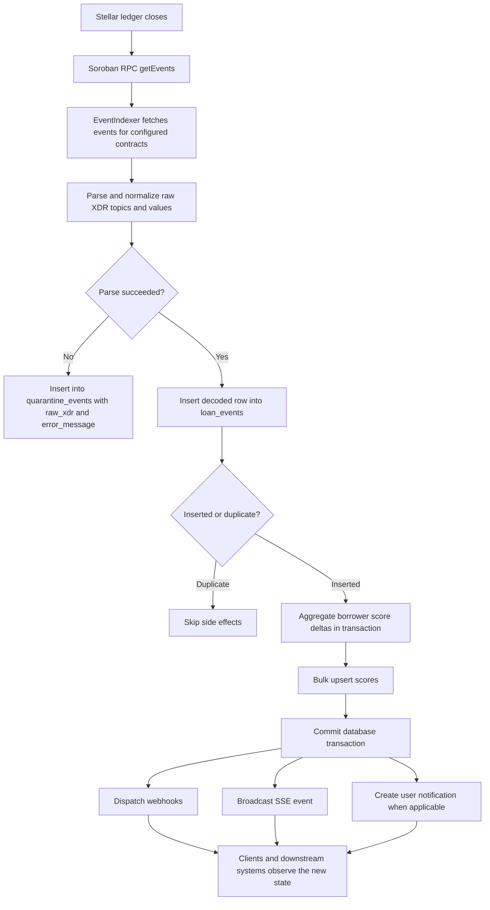

# Indexer Sync Flow

This page explains how Remitlend moves Soroban contract events from Stellar RPC into PostgreSQL, updates downstream borrower state, and pushes real-time updates to clients.

It is meant to answer one practical question: when an on-chain event happens, how does it become queryable backend state?

## Scope

The backend indexer currently watches the configured Remitlend contracts, including:

- `LOAN_MANAGER_CONTRACT_ID`
- `LENDING_POOL_CONTRACT_ID`
- `REMITTANCE_NFT_CONTRACT_ID`
- `MULTISIG_GOVERNANCE_CONTRACT_ID`

These are gathered in `backend/src/services/indexerManager.ts` and passed into `EventIndexer` as the contract filter set.

## End-to-end flow



## Polling and sync loop

The polling loop lives in `backend/src/services/eventIndexer.ts`.

### Startup

On startup, `startIndexer()`:

1. Collects all configured contract IDs.
2. Builds an `EventIndexer` with:
   - RPC URL
   - contract list
   - `INDEXER_POLL_INTERVAL_MS` (default `30000`)
   - `INDEXER_BATCH_SIZE` (default `100`)
3. Starts the polling loop.

### Each poll cycle

For each iteration, the indexer:

1. Reads the latest stored progress from `indexer_state`.
2. Calls RPC to get the latest ledger sequence.
3. If no new ledger exists, it exits early.
4. Computes a bounded range:
   - `fromLedger = last_indexed_ledger + 1`
   - `toLedger = min(fromLedger + batchSize - 1, latestLedger)`
5. Fetches all matching contract events in that range.
6. Parses and stores them.
7. Advances `last_indexed_ledger` after the chunk succeeds.

This means the indexer progresses in ledger chunks, not one event at a time.

## Ledger cursor and `indexer_state`

The schema originally introduced both:

- `last_indexed_ledger`
- `last_indexed_cursor`

```sql
CREATE TABLE indexer_state (
  id SERIAL PRIMARY KEY,
  last_indexed_ledger INTEGER NOT NULL,
  last_indexed_cursor VARCHAR(255),
  updated_at TIMESTAMP DEFAULT NOW()
);
```

### What is actually authoritative today

In the current implementation, `last_indexed_ledger` is the authoritative checkpoint.

- The polling loop reads `last_indexed_ledger`
- It advances work by ledger range
- It updates `last_indexed_ledger` with the highest completed ledger

`last_indexed_cursor` still exists in the schema and in the status endpoint, but the active poller does not currently persist or resume from it. RPC pagination inside a single fetch uses an in-memory `cursor` variable only for that request loop.

### Why the ledger checkpoint matters

Using the last fully indexed ledger gives the indexer a simple recovery rule:

- if ledger `N` is stored, the next poll starts at `N + 1`
- a chunk is only advanced after successful processing
- partial progress within a failed chunk is not checkpointed as complete

### Multi-contract note

Although the indexer tracks a single ledger checkpoint row, the fetch itself filters against multiple configured contracts in the same pass. In practice, that means one ledger progress marker covers the shared synchronization position for all watched contracts.

## Fetch phase: RPC event collection

`fetchEventsInRange(startLedger, endLedger)` calls Soroban RPC `getEvents()` with:

- `startLedger`
- `endLedger`
- `limit = batchSize`
- contract filters for all configured contract IDs

If RPC returns multiple pages, the indexer follows `nextCursor` or `cursor` until no more results remain for that range.

Before processing, events are sorted by ledger so inserts and downstream side effects happen in a stable order.

## Parse phase: raw event to normalized event

Each raw Soroban event contains:

- event ID
- paging token
- topic array
- value
- ledger number
- ledger close time
- transaction hash
- contract ID

The indexer decodes the first topic as the event type, then normalizes aliases when needed. Examples:

- `Mint` -> `NFTMinted`
- `ScoreUpd` -> `ScoreUpdated`
- `Seized` -> `NFTSeized`
- `GovProp` -> `ProposalCreated`

It then decodes event-specific fields from topics and value.

### Core loan event mapping

#### `LoanRequested`

- `topic[1]` -> borrower address
- `value` -> amount

#### `LoanApproved`

- `topic[1]` -> loan ID
- `topic[2]` -> borrower address
- `value` -> tuple containing:
  - `interest_rate_bps`
  - `term_ledgers`

#### `LoanRepaid`

- `topic[1]` -> borrower address
- `topic[2]` -> loan ID
- `value` -> repayment amount

#### `LoanDefaulted`

- `topic[1]` -> loan ID
- `value` -> borrower address

Other supported events, including pool, NFT, governance, and transfer events, are normalized into the same storage pipeline.

## Database write phase

Successfully parsed events are inserted into `loan_events` inside a database transaction.

### `loan_events` schema

The full event table stores both decoded fields and enough raw context for replay/debugging:

```sql
CREATE TABLE loan_events (
  id SERIAL PRIMARY KEY,
  event_id VARCHAR(255) NOT NULL UNIQUE,
  event_type VARCHAR(50) NOT NULL,
  loan_id INTEGER,
  borrower VARCHAR(255) NOT NULL,
  amount NUMERIC,
  ledger INTEGER NOT NULL,
  ledger_closed_at TIMESTAMP NOT NULL,
  tx_hash VARCHAR(255) NOT NULL,
  contract_id VARCHAR(255) NOT NULL,
  topics JSONB,
  value TEXT,
  created_at TIMESTAMP DEFAULT NOW()
);
```

Additional migrations also add:

- `interest_rate_bps`
- `term_ledgers`
- indexes for borrower, event type, loan ID, ledger, and recent-query patterns
- uniqueness protections for some non-repeatable loan status events

### Deduplication

The primary duplicate guard is:

- `ON CONFLICT (event_id) DO NOTHING`

That means if the same RPC event is fetched twice, the row is skipped and no downstream side effects fire again.

There are also migration-level unique indexes for some status transitions such as `LoanApproved` and `LoanDefaulted` per loan, which protect against duplicate semantic status rows.

## Score update phase

After an event row is inserted, the indexer may accumulate borrower score changes inside the same transaction.

Current rules in the indexer:

- `LoanRepaid` -> add `repaymentDelta`
- `LoanDefaulted` -> subtract `defaultPenalty`
- `CollateralLiquidated` -> subtract `defaultPenalty`

Those values come from `sorobanService.getScoreConfig()`, not hardcoded constants.

The indexer batches score changes in memory per borrower and applies them with a single bulk score upsert before commit. This is important because it keeps:

- event inserts
- score changes

atomically consistent. Either both commit, or both roll back.

## SSE push and other downstream side effects

After the transaction commits, each inserted event triggers non-transactional side effects:

1. **Webhook dispatch**
2. **SSE broadcast** via `eventStreamService.broadcast(...)`
3. **User notifications** for borrower-facing loan events

### SSE behavior

The SSE endpoint is `GET /api/events/stream`.

When a new event is broadcast, connected clients receive a payload containing fields such as:

- `eventId`
- `eventType`
- `loanId`
- `borrower`
- `amount`
- `ledger`
- `ledgerClosedAt`
- `txHash`

The stream controller also supports replay from `Last-Event-ID` by querying `loan_events`, so the database is the durable source and SSE is the live delivery layer.

## Restart and catch-up behavior

This is the part contributors usually care about most.

### Normal restart

When the backend restarts:

1. The indexer starts again.
2. It reads `last_indexed_ledger` from `indexer_state`.
3. It compares that value to the latest chain ledger.
4. It begins processing from the next missing ledger onward.

So the service naturally enters catch-up mode whenever the chain has advanced while the backend was down.

### Why this works

Because the checkpoint only advances after a successful chunk:

- completed chunks are not reprocessed as new work, except for harmless duplicate fetches
- incomplete chunks are retried from the last persisted ledger boundary
- duplicate RPC results are safely ignored by `event_id` uniqueness

### Manual catch-up / reindex

The service also exposes range reindexing through `reindexRange(fromLedger, toLedger)`, which processes ledger ranges chunk by chunk and reports:

- fetched event count
- inserted event count
- last processed ledger

This is useful for repairing gaps or backfilling after operational issues.

## Multi-contract indexing architecture

The indexer is single-service but multi-contract.

### How it is configured

`indexerManager.ts` collects up to four contract IDs from environment variables and passes them to `EventIndexer`.

The RPC request uses a contract filter containing all configured IDs, so one polling pass can ingest:

- loan lifecycle events
- lending pool events
- remittance NFT / score events
- governance events

### Why this matters

A single borrower journey may span multiple contracts. For example:

- loan approval may come from the loan manager
- score-related or NFT-related events may come from the remittance NFT contract
- liquidity events may come from the pool contract

Persisting them into one normalized event table lets backend APIs query a unified history without doing cross-contract RPC lookups at read time.

## Failure modes and recovery

### 1. RPC request fails

If RPC lookup fails for a poll iteration, the error is logged and the next scheduled poll retries.

Recovery characteristic:

- no checkpoint advance occurs for failed work
- catch-up resumes on the next healthy poll

### 2. Event parse fails

If an event cannot be decoded, it is not silently dropped. The indexer writes it to `quarantine_events`.

```sql
CREATE TABLE quarantine_events (
  id SERIAL PRIMARY KEY,
  event_id VARCHAR(255) NOT NULL UNIQUE,
  ledger INTEGER NOT NULL,
  tx_hash VARCHAR(255) NOT NULL,
  contract_id VARCHAR(255) NOT NULL,
  raw_xdr JSONB NOT NULL,
  error_message TEXT NOT NULL,
  quarantined_at TIMESTAMP DEFAULT NOW()
);
```

Recovery characteristic:

- other valid events in the batch can still continue
- malformed payloads remain inspectable for debugging
- quarantine growth is logged, with an alert threshold via `QUARANTINE_ALERT_THRESHOLD`

### 3. Database insert fails

Event inserts and score updates run in a transaction.

Recovery characteristic:

- partial writes do not commit
- the chunk is retried later from the last stored ledger checkpoint

### 4. Duplicate event delivery

RPC may surface the same event again, especially around retries or manual reindexing.

Recovery characteristic:

- `event_id` uniqueness makes repeated ingestion idempotent
- duplicate rows do not re-trigger score updates, notifications, webhooks, or SSE pushes

### 5. Process crash during catch-up

If the service crashes during a backlog run, progress after the last committed ledger is retried on restart.

Recovery characteristic:

- durable checkpoint in `indexer_state`
- chunk-based replay
- deduplication protects against over-application

## Practical mental model

A good way to think about the system is:

- **Stellar ledger** is the source of truth for what happened
- **RPC** is the transport used to read those events
- **EventIndexer** is the interpreter and write coordinator
- **`loan_events`** is the durable queryable event history
- **`scores`** is derived borrower state updated atomically from indexed events
- **SSE/webhooks/notifications** are delivery mechanisms that fan out committed changes

If you are debugging missing borrower activity, the usual path is:

1. Check the chain event exists.
2. Check `indexer_state` lag.
3. Check `loan_events` for the event.
4. Check `quarantine_events` for parse failures.
5. Check SSE/webhook consumers only after the database write path is confirmed.

## Relevant files

- `backend/src/services/eventIndexer.ts`
- `backend/src/services/indexerManager.ts`
- `backend/src/controllers/indexerController.ts`
- `backend/src/controllers/eventStreamController.ts`
- `backend/migrations/1771691269866_loan-events-schema.js`
- `backend/migrations/1778000000008_quarantine-events.js`
- `backend/migrations/1789000000000_ensure-core-tables.js`
